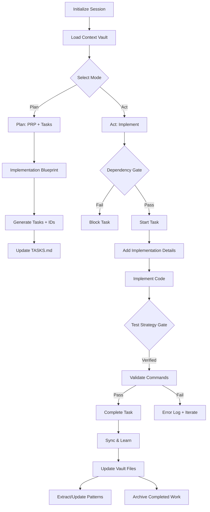

## Narrative (10 lines)
- Initialize by loading the Vault: brief, active-context, patterns, progress.
- Choose mode by user intent: Plan (write/organize) or Act (implement/test).
- Plan mode produces a Thin PRP and tasks with deterministic IDs and clear validation.
- Update TASKS.md with visual status and implementation indicators.
- Act mode enforces the Dependency Gate before any work can start.
- Implement strictly via the task's Implementation Details; keep changes minimal.
- Enforce Test Strategy Gate; run or confirm exact validation commands.
- Mark complete only after cleanup and successful validation.
- Sync Vault: update progress, evolve patterns, refresh agent-notes (extended handoff + retro), and archive completed items.
- Prepare handoff: concise state & next steps in active-context; richer cross-agent context in agent-notes.

See `@standards.md` for gates, IDs, and icon mappings.
