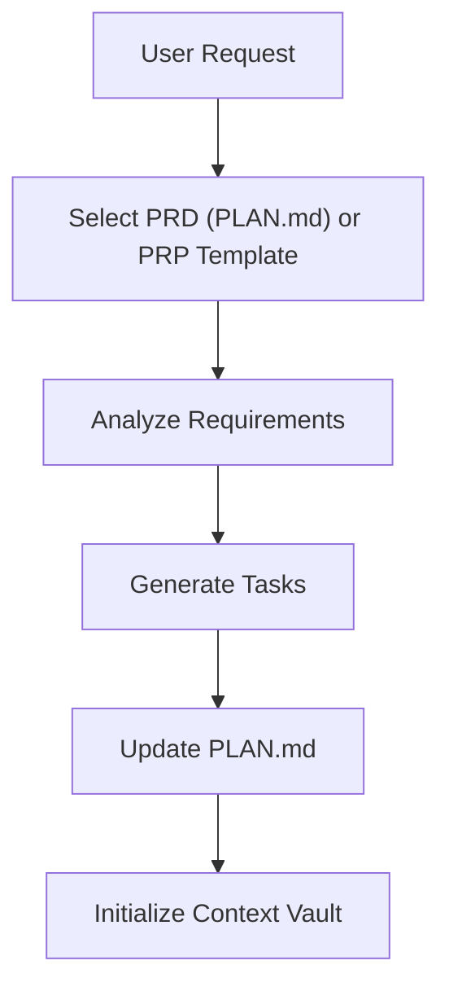
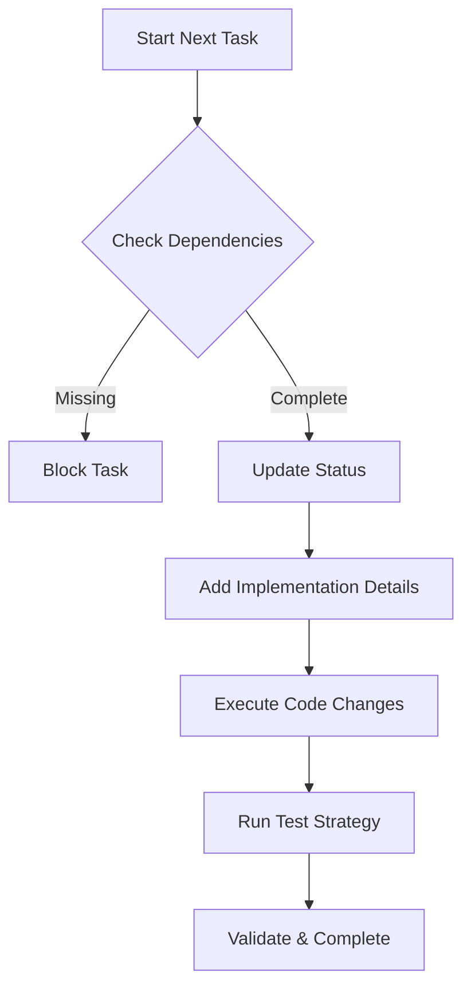
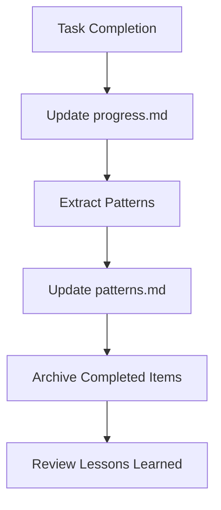

# Kanónes: A Comprehensive Ruleset for Agentic Systems

An agent-ready ruleset for Cursor, VS Code, and Windsurf that combines:
- **Persistent Context Vault** with multi-agent handoff support
- **Unified phase-based workflow** with strict Plan/Act mode gating
- **Enhanced PRP (Product Requirements Prompt)** methodology with detailed templates
- **Advanced task management** with dependency gating, implementation tracking, and visual status indicators
- **Quality standards** with test strategy enforcement and validation requirements
- **Learning loops** through patterns.md evolution and progress tracking
- **Mermaid diagrams** for workflow visualization

## Key Features

### 🤖 **Multi-Agent Compatibility**
- Seamless handoff between Claude, GPT, Gemini, and human developers
- Agent-specific notes and preferences tracking
- Standardized context format across all AI platforms

### 📋 **Advanced Task Management**
- **Dependency Gating**: Tasks cannot start unless all dependencies are completed
- **Implementation Status Tracking**: detailed → code_ready → partially_implemented → fully_implemented
- **Visual Status Indicators**: Rich icon system with priority colors and implementation states
- **Dot-ID Support**: Full support for subtask IDs (42.1, 42.2, etc.)
- **Parent-Child Relationships**: Automatic blocking and completion logic

### 🧪 **Quality Assurance**
- **Test Strategy Enforcement**: Mandatory test verification before completion
- **Validation Commands**: Exact commands with expected outputs
- **Rollback Plans**: Documented recovery procedures for all changes
- **Debug Cleanup**: Automatic removal of temporary code

### 📊 **Enhanced Planning**
- Two templates: PRD for `PLAN.md` (project-wide) and PRP for features (implementation-ready)
- Global `PLAN.md`: Project overview with feature status tracking
- Success Metrics: Measurable outcomes and KPIs

### 🏗️ **Context Vault**
- **Session Continuity**: Persistent memory across AI sessions
- **Pattern Evolution**: Lessons learned and decision tracking
- **Progress Journal**: Dated change tracking with outcomes
- **Emergency Recovery**: Vault corruption recovery procedures

## Directory Structure

```
└── kanónes/
	├── README.md
	├── docs/
	│   └── diagrams.md                    # Mermaid workflow diagrams
	├── .cursor/rules/.kanónes/
	│   ├── root.mdc               # Entry point and guarantees
	│   ├── workflow.mdc           # Canonical lifecycle diagram + narrative
	│   ├── standards.mdc          # SoT: dir map, IDs, icons, gates, expansion
	│   ├── context-vault.mdc      # Context management & sync
	│   ├── session-lifecycle.mdc    # Operator checklist (links to SoT)
	│   ├── plans.mdc         # PRD (PLAN.md) + PRP (Feature) templates
	│   ├── tasks.mdc         # YAML schema, Impl. Details, expansion refs
	│   └── expand.mdc             # Trimmed examples; policy in standards
	├── .vscode/rules/.kanónes/    # Same structure as .cursor/
	└── .windsurf/rules/.kanónes/  # Same structure as .cursor/
	└── .vault/                            # Context Vault (runtime)
	    ├── memory/                       # Persistent project context
	    │   ├── brief.md                  # Mission & constraints
	    │   ├── active-context.md         # Current focus & state
	    │   ├── patterns.md               # Conventions & decisions
	    │   ├── progress.md               # Change journal
	    │   └── agent-notes.md            # Multi-agent tips
	    ├── plans/                        # Project plans & PRPs
	    │   ├── PLAN.md                   # Global project overview
	    │   ├── features/                 # Feature-specific PRPs
	    │   ├── archives/                 # Completed PRPs
	    │   └── PLANS_LOG.md              # Plan history
	    └── tasks/                        # Task management
	        ├── TASKS.md                  # Active task checklist
	        ├── task{id}_*.md             # Individual task files
	        ├── archives/                 # Completed tasks
	        └── TASKS_LOG.md              # Task history
```

## Quick Start (Review Mode)

1. **Understand the System**
   - Read `.cursor/rules/.kanónes/root.mdc` for mental model and guarantees
   - Review `context-vault.mdc` for context management and multi-agent handoff
   - Study `session-lifecycle.mdc` for the phase-based lifecycle

2. **Learn Key Workflows**
   - `plans.mdc`: PRP creation and PLAN.md management
   - `tasks.mdc`: Task lifecycle with dependency gating and status tracking
   - `expand.mdc`: Task decomposition when complexity exceeds 2-3 hours

3. **Explore Templates**
   - Comprehensive PRP templates with 10 sections and examples
   - Task file format with enhanced YAML frontmatter
   - Implementation details structure with validation commands

## Quick Start (Activation)

1. **Setup Rules**
   - Copy `.cursor/rules/.kanónes/` to project root `.cursor/rules/.kanónes/`
   - Or use `.vscode/rules/.kanónes/` or `.windsurf/rules/.kanónes/` for other IDEs
   - IDE will auto-discover and activate the rules

2. **Initialize Context Vault**
   - Create `.vault/memory/` directory in project root
   - Add starter files: `brief.md`, `active-context.md`, `patterns.md`, `progress.md`
   - Use templates from the rule files to populate initial content

3. **Setup Task Management**
   - Create `.vault/tasks/TASKS.md` for active task overview
   - Create `.vault/plans/PLAN.md` for project overview
   - Individual task files will be created automatically

## Core Workflows

### 📝 **Planning Phase (Plan Mode)**


### ⚡ **Execution Phase (Act Mode)**


### 🧠 **Learning Loop**


## Command Reference

### Task Management
- `create tasks from <PRP>` - Generate tasks from a PRP
- `show tasks` - Display TASKS.md
- `show task {id}` - Display specific task details
- `start task {id}` - Begin work on task
- `complete task {id}` - Mark task complete
- `block task {id} waiting on {deps}` - Mark as blocked

### Planning
- `@expand.mdc analyze task {id}` - Break down complex tasks
- `@plans.mdc create PRP for <feature>` - Create new PRP
- `@context-vault.mdc sync` - Update vault state

### Quality Gates
- **Dependency Check**: Tasks cannot start with incomplete dependencies
- **Test Strategy**: Mandatory verification before completion
- **Implementation Details**: Required for code changes
- **Rollback Plan**: Documented for complex changes

## System Guarantees

### 🔒 **Safety**
- Strict Plan/Act mode separation
- Dependency validation before execution
- Test strategy enforcement
- Debug code cleanup requirements

### 📊 **Quality**
- Maximum 3-hour task sizing
- Copy-paste ready implementation details
- Exact validation commands with outputs
- Rollback procedures for all changes

### 🤝 **Collaboration**
- Multi-agent context handoff
- Standardized file formats
- Bidirectional sync between files
- Agent-specific notes and preferences

### 🔄 **Evolution**
- Pattern extraction from completed work
- Progress tracking with outcomes
- Learning loops through patterns.md
- Emergency recovery procedures

## Integration Points

### Version Control
- Suggested `.gitignore` entries for sensitive files
- Commit message format: `Task {ID}: {Summary} [kanónes]`
- Vault backup and recovery procedures

### Development Workflow
- Pre-commit hooks for quality checks
- CI/CD integration points
- Environment-specific configurations
- Deployment coordination

## Troubleshooting

### Common Issues
- **Dependency Errors**: Check task status in TASKS.md
- **Context Sync**: Run `@context-vault.mdc sync`
- **Archive Problems**: Verify directory permissions
- **Multi-Agent Handoff**: Check active-context.md

### Recovery Procedures
- **Lost Tasks**: Check `.vault/tasks/archives/`
- **Vault Corruption**: Use emergency recovery scripts
- **Failed Archive**: Manual cleanup with `mv` commands
- **Sync Issues**: Rebuild from git history

## Contributing

The Kanónes system is designed to evolve with your needs:
1. Add new patterns to `patterns.md` as you learn
2. Extend templates in the rule files
3. Customize agent notes for your team
4. Contribute improvements back to the community

## Naming

This variant is called **Kanónes** (Greek: "rules" or "laws") and is purpose-built for IDE agents (Cursor, VS Code, Windsurf) with a Context Vault at `.vault/`. The system provides a comprehensive framework for agentic development with persistent context, strict quality gates, and seamless multi-agent collaboration.
