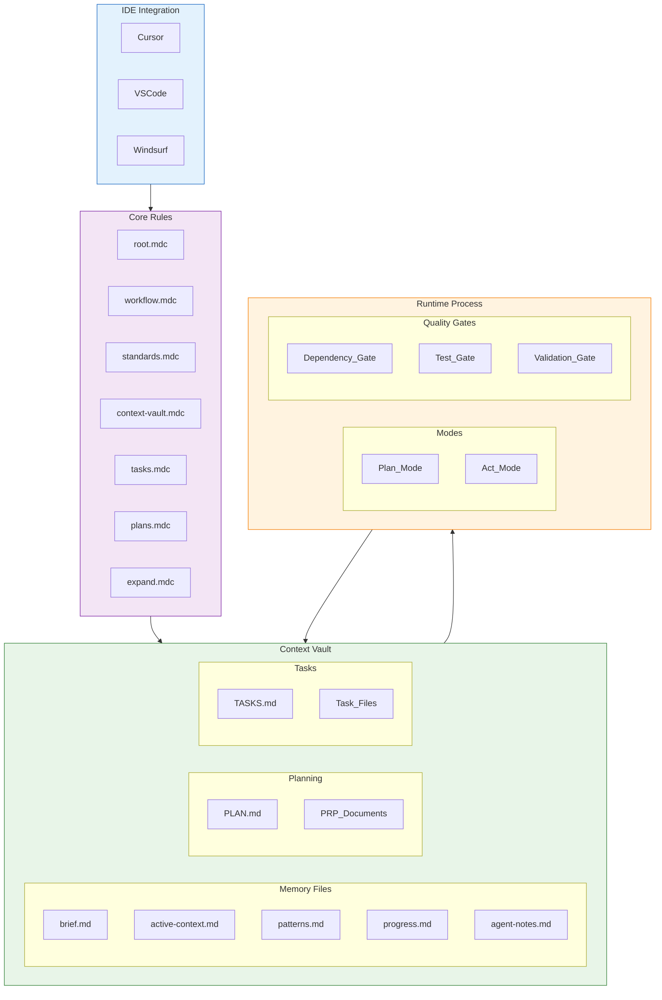
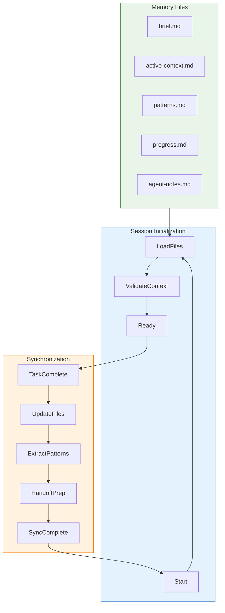
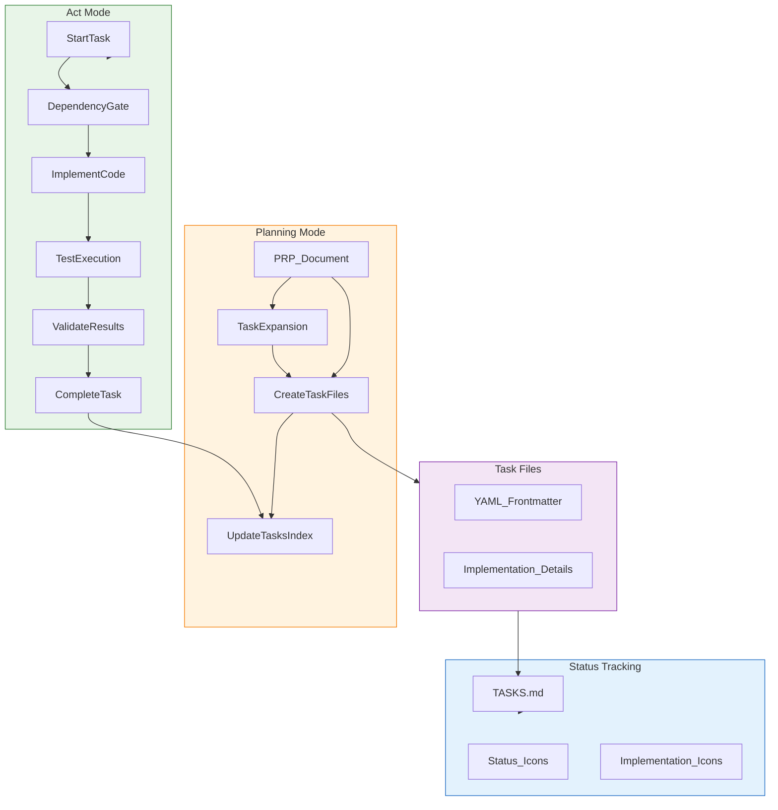
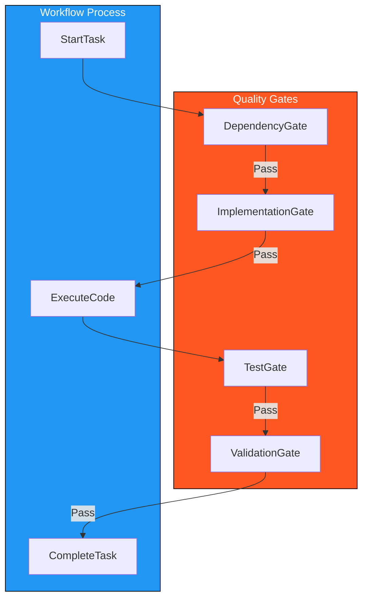
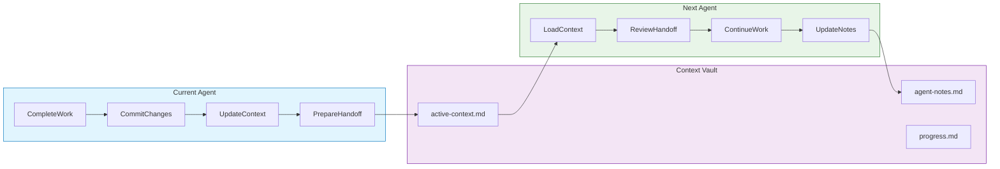
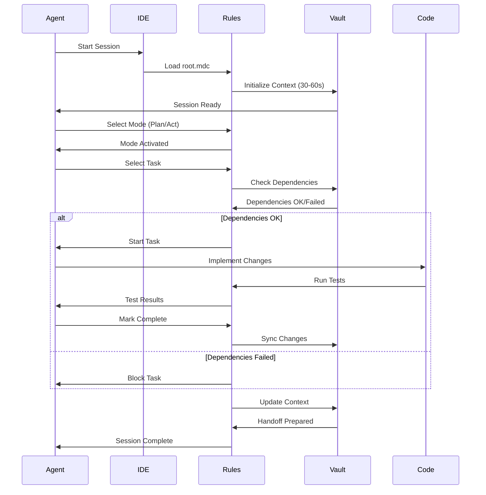

# Kanónes System Diagrams

Simple, clear diagrams showing the Kanónes system architecture and workflow.

## System Overview

## Context Vault Memory System

## Task Management System

## Quality Gates & Workflow

## Multi-Agent Handoff

## Session Workflow Sequence

